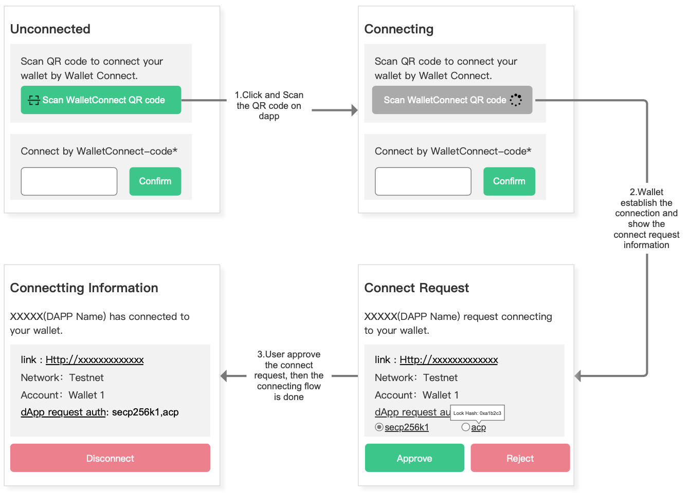

## 1 Background
WalletConnect is the decentralized Web3 messaging layer and a standard to connect blockchain wallets to dapps. It is chain agnostic and built to work with any blockchain of user's choice. Currently, many blockchains have already implemented convenient communication using WalletConnect. However, for some specific type of blockchain protocols like Bitcoin with UTXO model, CKB with Cell model, and so on, the current interaction methods are **NOT** well-suited. While using these chains, users are able to send **different kinds of tokens** with **multiple addresses** in a **single** transaction.

Take CKB network for example, some wallets like Neuron supports signing/sending transaction directly. But it can't communicate with dapp to initiate signatures and transactions.

So we proposed a way to integrate WalletConnect to achieve collaboration with dapp quickly.

## 2 Abstract
This article introduces **a user interaction specification** for the WalletConnect protocol based on CKB. The main focus of the article is to present a universal component that can be integrated into various wallet projects. If you're a developer or a product manager of a crypto wallet, this may help you understand what it looks like.

The article will demonstrate how the WalletConnect connection, for a multi-address model or so-called Account Model which means users could simultaneously using multiply addresses within one series of mnemonics, should be reflected in the user interaction layer, covering the main processes, states, fields, and more related to the universal component. Reading this article will help you develop an roughly understanding of how a user could connect his ckb "account" to a dapp by WalletConnect , what the fields should be contained and what it looks, should you wish to enable this feature in your wallet.

To avoid some misunderstanding on UI side, the prototype is designed without any specific context, and we also introduce all the related fields fist before the prototype, it's recommended to take the Corresponding functions and Labels in to consideration while designing your own UI based on this article. The Corresponding functions and Labels could also help when you find some numbers or feilds on the prototype, you can go back to check what the fields means.

## 3 Overview of WalletConnect UX protocol

Wallet Application usually provide some entries and a popup window for showing the wallet information for the users.
The entries could keep using the same original one, like a scan icon adopted in many current crypto wallets.

  

After clicking this icon, and scan the walletconnect QR Code on users' trusted website, the user will be prompted to see the connection information

For our walletconnect general component, we intergrated the entry and the connection information. Below is the overview of what it looks like. You can quick scan all the fields to be displayed for users roughly.
  

## 4 UX Protocol Description

### 4.1 Connecting flowchart

> Still scanning QR code is the most used and also recommended for users to connect to dapp with your wallet, connectting by pasting the WalletConnect code could be used for testing.

#### 4.1.1 Corresponding functions and Labels
All the labels and functions which are used to construct the the prototype are listed if you'd like to integrate them into your app in your own way.

|Flow|Name|Type|Requirement Levels|Note|
| -- | -- | -- | -- | -- |
|Connecting flow|Scan WalletConnect QR code|Function|MUST|--|
| Connecting flow | Connect by WalletConnect-code | Function | SHOULD NOT | Supposed to be only used for testing |
| Connecting flow | link | Label | MUST | The URL of the dapp |
| Connecting flow | Network | Label | MUST | The network of current CKB blockchain |
| Connecting flow | Account | Label | MUST | The account user is using on wallet.Usually, it's the current using series of nmnemonics |
| Connecting flow | Lock Hash | Label | MUST | This means the lock method for user address sets that dapp would like to get access to. [Why this is necessary？](/Neuron-PRDs/WalletConnect/FAQ_en.md)|
| Connecting flow | Disconnect | Function | MUST | -- |

  

#### 4.1.2 Status1: Unconnected

While the dapp is unconnected with the wallet, users can use scan WalletConnect QR code function in order to connect the dapp. This function is just like the single address communication WalletConnect protocol. 

  

#### 4.1.3 Status2: Connecting

To go on connectting, users are always supposed to click a scan button, and if the QR code is correct then the dapp and wallet are trying to communicate following the protocol. If the QR code is not in correct format, some corresponding error messages will pop up.

  

#### 4.1.4 Status3: Connect Request

Once the WalletConnection information fecthes back, the wallet shows the connection request information, including the dapp name, its url, network, Account and Auth.

- The network refers to the CKB network to which the dapp is going to connect.
- The Account refers to the CKB wallet account that the user is going to use.
- The Auth refers to the lock method for user addresses. Typically, a user's addresses can be divided into different adress sets based on the lock method they use, and here various classification methods are provided. dapps can request the specific address sets they need, and users can choose to revoke authorization for certain address sets. It is specified that when the method for requesting Lock Hash from Dapp side has no parameters, the Dapp requests all Lock Hashes. When the Dapp provides specific Lock Hashes, it requests the specified Lock Hashes addresses set.

To cancel this request, just press the Reject button.

#### 4.1.5 Status4: Connectting Information

After the connection is established, the dapp will maintain a persistent connection with the wallet. The relevant connection information, the confirmed information from the previous step, will still be displayed here. Users can disconnect from the dapp at any time.

### 4.2 Signing a Message
When a dapp requires the user to perform a signature operation, it can be done through a signature information flow.

|Flow|Name|Type|Requirement Levels|Note|
| -- | -- | -- | -- | -- |
| Signing a Message | link | Label | MUST | The URL of the dapp |
| Signing a Message | Network | Label | MUST | The network that dapp wants the user to sign on |
| Signing a Message | Message | Label | MUST | The message that dapp wants the user to sign with|

Based on the Connected state, the dapp will send a signature request to the wallet. Users can choose to sign or not sign the request on the wallet.

  

Users should be familiar with, understand, and trust the content of their signature before proceeding.

### 4.3 Signing Tx flowchart

#### 4.3.1 Corresponding functions and Labels
|Flow|Name|Type|Requirement Levels|Note|
| -- | -- | -- | -- | -- |
| Send a transaction | link | Label | MUST | The URL of the dapp |
| Send a transaction | Network | Label | MUST | The network that dapp wants the user to sign on |
| Send a transaction | Payment method | Label | SHOULD | Currently, the CKB transactions are all TRANSFER. |
| Send a transaction | To Address List | Label | MUST | **There could be more than 1 address in this case. So the whole list should also be shown to the user.** |
| Send a transaction | Asset Amounts | Label | MUST | This value represents the total capacity change of connected addresses in this transaction. And if there is any other kind of Cell like SUDT or NFT and so on, a **label** MUST be marked between the CKB number, like 1,00,300CKB*(including 10SUDT).|
| Send a transaction | Fee or Fee Rate | Label | MUST | -- |
| Send a transaction | Description | Label | MUST | -- |
| Send a transaction | Locktime | Label | OPTIONAL | -- |
| Send a transaction | Recieve Amount for individual address in the to_address list. | Label | MUST | This refers to the amounts that every individual address will receive |
| Send a transaction | Transaction Info Modify | Function | MUST | Users are able to modify or adjust some data in the transaction like Fee Rate |
| Send a transaction | Transaction Data for individual address | Label | MUST | -- |
| Send a transaction | Witness for individual address | Label | MUST | -- |
| Send a transaction | Decode Data for individual address | Function | SHOULD | The individual data could be decoded for easier reading, however, different sources have been given for users/wallet to choose. |
| Send a transaction | Transaction Raw Data  | Label | SHOULD | Transaction Input will be displayed for professional users or any advanced usage. Through the transaction raw data, users can understand the inputs and outputs associated with this transaction.|

When dapp initializes a transaction, this component will pop up/ show, And these fields will show as we proposed.

#### 4.3.2 To confirm/reject a transaction from dapp

- Normally, if the user want sign the transaction by simply click the NEXT btn then click CONFIRM btn.
  

- To reject or cancel this transaction , you can click REJECT Btn
on the first step.

#### 4.3.3 To modify the transaction information

- Click the modify icon
  

- Then modify information in corresponding text field, and continue.

#### 4.3.4 Further examine the receiving address and its detailed data

The following chart shows different cases where the user wants to check the receiving addresses and there are multiple reciever addresses or multiple assets.

While do your own design, it's recommended that all the reciever addresses and assets related in this transaction should be able to reached and examined by the user.

- Check more addresses and go to the individual address detail pages. 

  

### 4.4 While wallet is offline

Offline Wallet Case: Considering the current priority of demands, we believe that the case of hot wallets connecting to Dapps is more common. Therefore, the interaction entities in this protocol are "hot wallets" and "Dapps". See more at [FAQ](/ux/wallet-connect-ux/FAQ_en.md).

While wallet is offline, a pop-up could be triggered to remind user to reconnect or keep offline.

|Flow|Name|Type|Requirement Levels|Note|
| -- | -- | -- | -- | -- |
| Offline usage | link | Label | MUST | The URL of the dapp |
| Offline usage | Network Name | Label | MUST | The network that dapp wants the user to sign on |

 
